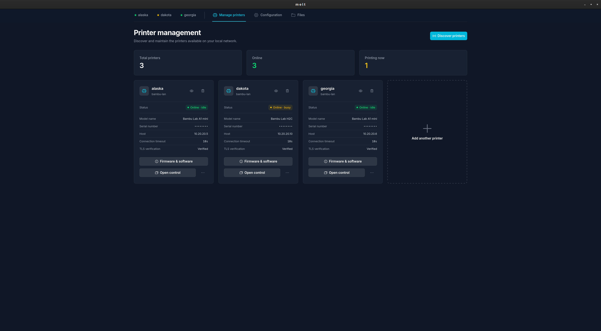
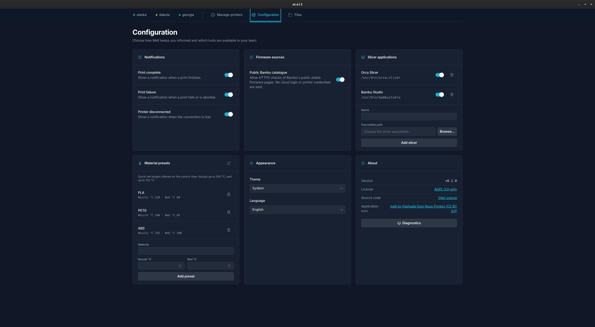
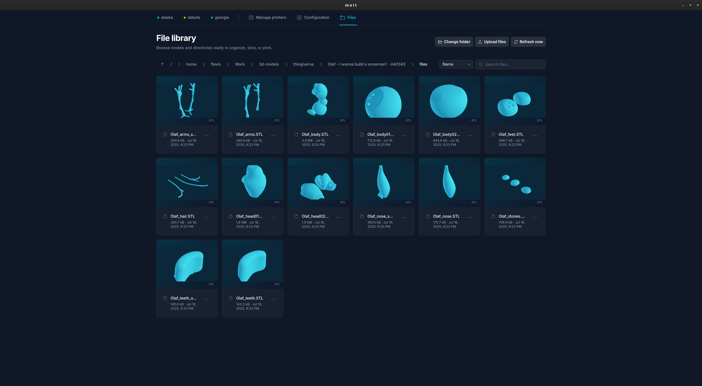
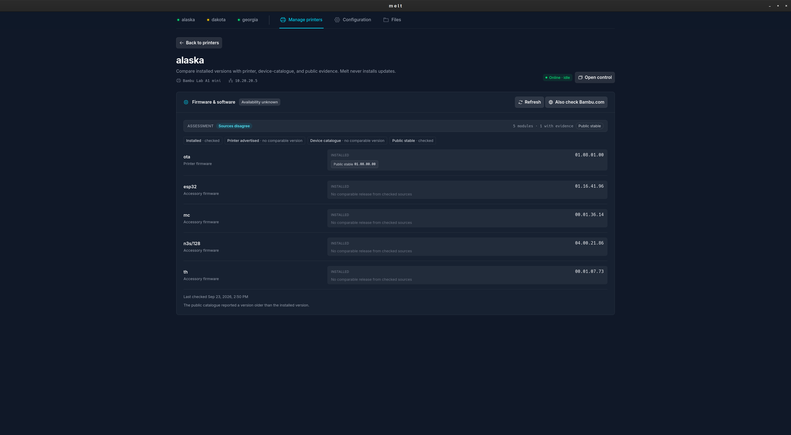
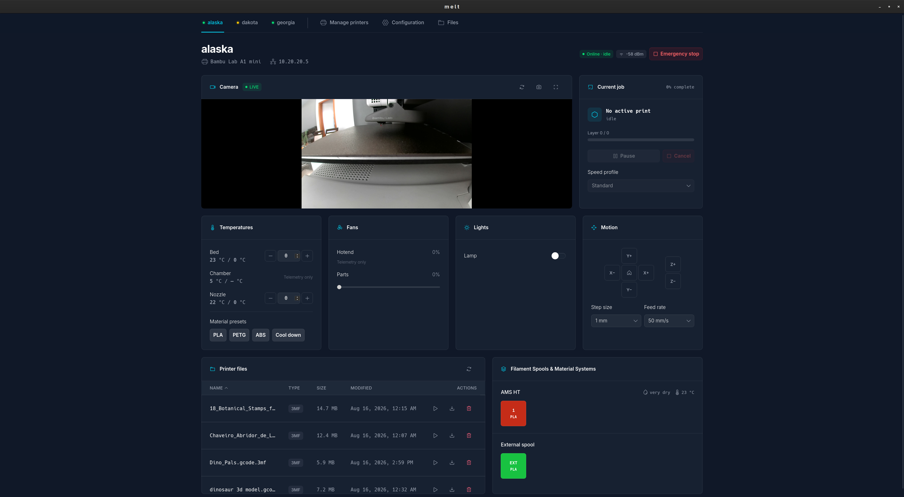
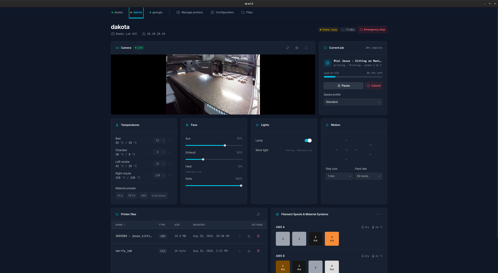

# Screenshots

A tour of the desktop application's main views.

## Manage printers

Fleet overview: total, online, and printing counts, plus per-printer status,
model, host, and quick actions.

## Configuration

Notifications, firmware sources, registered slicer applications, material
presets, appearance, and version/license information.

## File library

Browsing a directory of model files with size and modified date, ready to
organize, slice, or print.

## Firmware & software

Per-printer comparison of installed module versions against printer-advertised,
device-catalogue, and public-stable evidence.

## Printer control — idle

Camera, current job, temperatures, fans, lights, motion controls, printer
files, and AMS/material systems for an idle printer.

## Printer control — printing

The same control view mid-print, with job progress, layer count, time
remaining, and live AMS slot assignments.

